# Allarme GSM (Arduino Mega)

Sistema di allarme domestico intelligente basato su Arduino Mega 2560 con display LCD 20x4 (I2C), tastiera 4x3, sensori RF 433 MHz e modulo GSM (SIM7600) per inviare SMS di notifica. La configurazione (seriale dispositivo, PIN e numero di telefono) è persistita in EEPROM. Il menu su LCD consente l'attivazione, la gestione dei sensori RF e vari test.

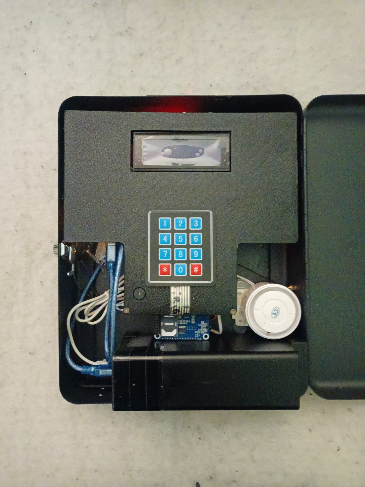

## Caratteristiche principali
- LCD 20x4 su I2C (indirizzo 0x27) per stato e menu.
- Tastiera 4x3 per PIN, navigazione e configurazione.
- Sensori RF 433 MHz: associazione, trasmissione codice e cancellazione.
- Memorizzazione configurazioni in EEPROM con controllo versione.
- Invio SMS tramite modulo SIM7600 con comandi AT su `Serial1`.
- Attivazione/disattivazione allarme con PIN o via RF.
- Sirena su relè esterno; buzzer integrato.
- Luminosità regolata via PWM.

## Hardware richiesto
- Arduino Mega 2560 (FQBN: `arduino:avr:mega`).

  

- Modulo GSM SIM7600 collegato a `Serial1` (TX1/RX1) e al pin `POWERKEY`.

  

- LCD 20x4 I2C (PCF8574) indirizzo 0x27.

  

- Ricevitore + trasmettitore RF 433 MHz compatibile con `RCSwitch`.

   

- Tastiera matriciale 4x3.

  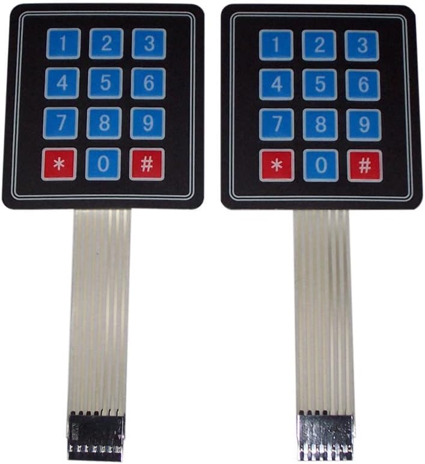

- Buzzer piezo 5V.

  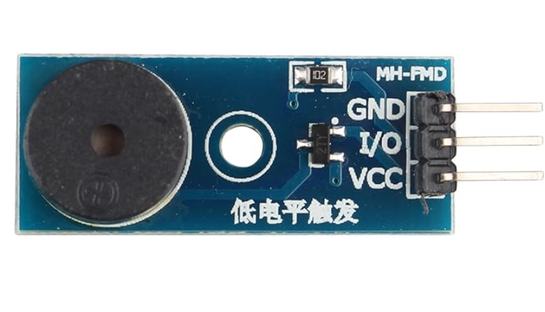

- Relè per sirena esterna (4 o 2 canali).

  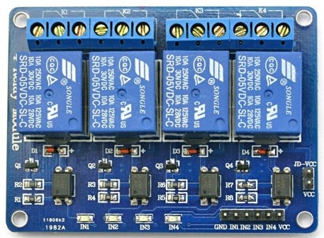

- Sensori RF 433 MHz (PIR, apertura porta, vibrazione, telecomando).

   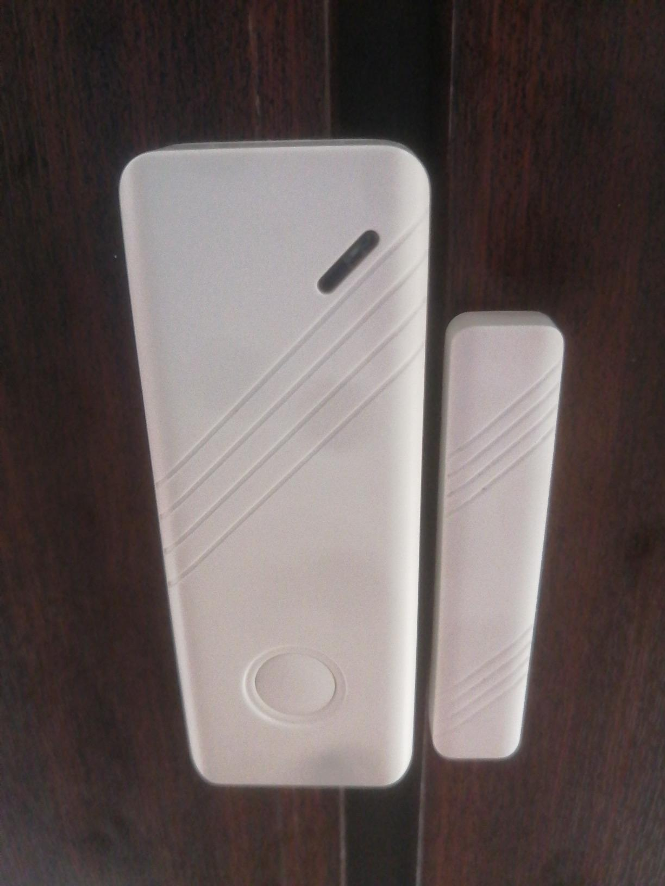

- Breadboard mini e cavetti Dupont.

## Pinout (principali)
- `POWERKEY = 4`
- `FLIGHTMODE = 3`
- `GSMRELAY = 11` (attiva/disattiva alimentazione modulo GSM)
- `RFDATA = 2` e `RFINTERRUPT = 0` (Interrupt 0 su Mega = PIN 2)
- `EXTALARM = 13` (ingresso allarme esterno, opzionale)
- `EXTRELAY = 12` (uscita sirena)
- `BUZZERPIN = 5`
- `LUMINOSITY = 6` (PWM retroilluminazione)
- `RFTRASMISSION = 14` (trasmettitore RF)
- Tastiera 4x3: righe `24, 26, 28, 30` e colonne `25, 27, 29`
- LCD I2C: indirizzo 0x27 su bus I2C (Mega: 20/SDA, 21/SCL)

## Stato e flusso di funzionamento
- Stato principale: `NORMAL` (visualizza stato, permette inserimento PIN) e `CONFIG` (menu di configurazione).
- Attivazione allarme:
  - Via RF: ricezione codice dispositivo (derivato dal seriale, es. `L000001` → `000001`).
  - Via menu: "Attiva Allarme" con conto alla rovescia (circa 60s su RF e ~30s in alcune routine).
- Disattivazione allarme: inserire PIN e confermare con `#`.
- Notifiche: quando l’allarme scatta, invia SMS al numero configurato; è presente anche una chiamata (facoltativa, commentata).

## Menu su LCD
Etichette definite in [AllarmeGSM.ino](AllarmeGSM.ino):
- Attiva Allarme
- Modifica Seriale
- Modifica PIN
- Modifica Telefono
- Associa Sensori
- Elimina Sensori
- Trasmetti Codice
- Test I/O
- Esci

Navigazione: `*` scorre, `#` conferma. Le funzioni operative sono implementate in [menu.ino](menu.ino) e [config.ino](config.ino).

### Schermate del Menu (esempi)
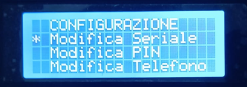
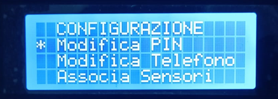
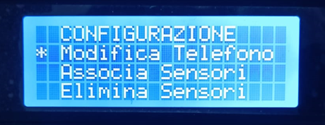
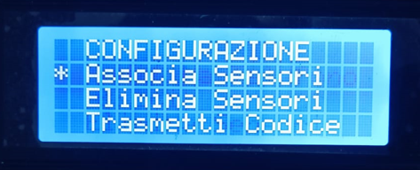
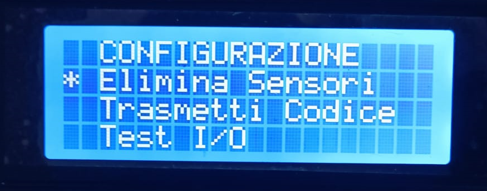

## Assemblaggio e Contenitore
Il progetto è completo di un contenitore esterno personalizzato con fori per il passaggio dei cavi e fissaggi per i componenti.

### Viste del Contenitore
| Frontale | Interno | Laterale |
|----------|---------|----------|
| 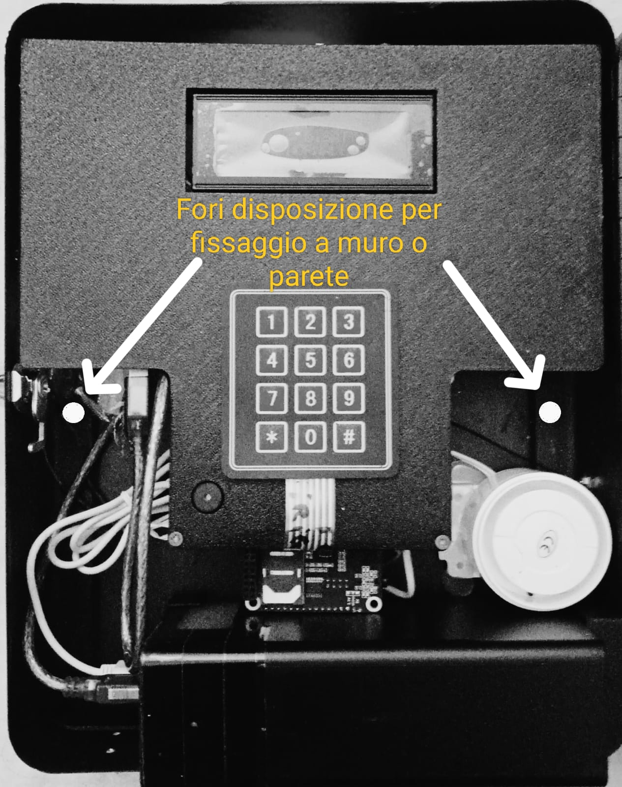 | 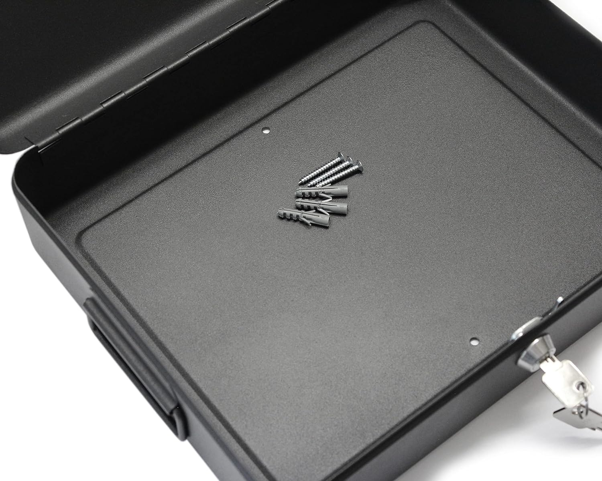 | 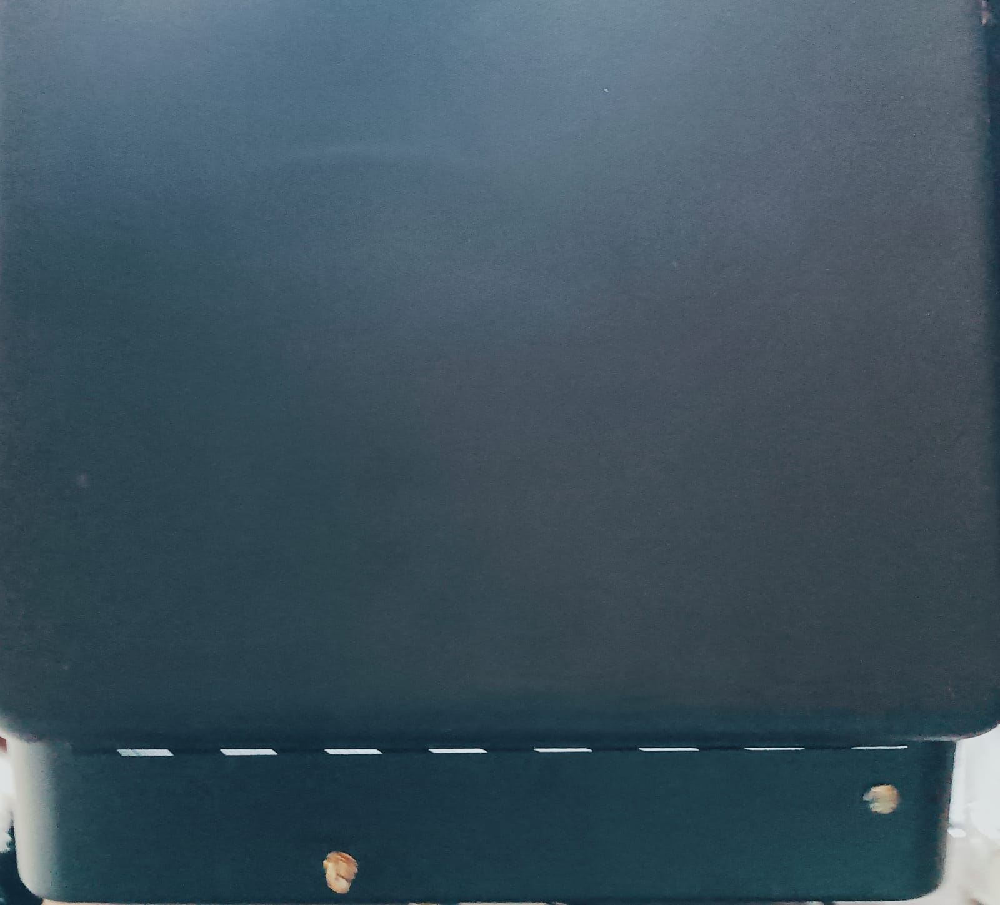 |

### Base Componenti
La base della scheda circuitale è stata personalizzata per ospitare Arduino Mega, i moduli RF, GSM e il relè.

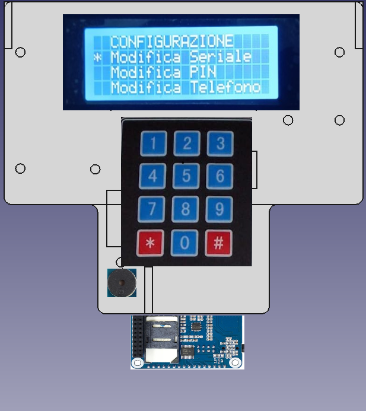
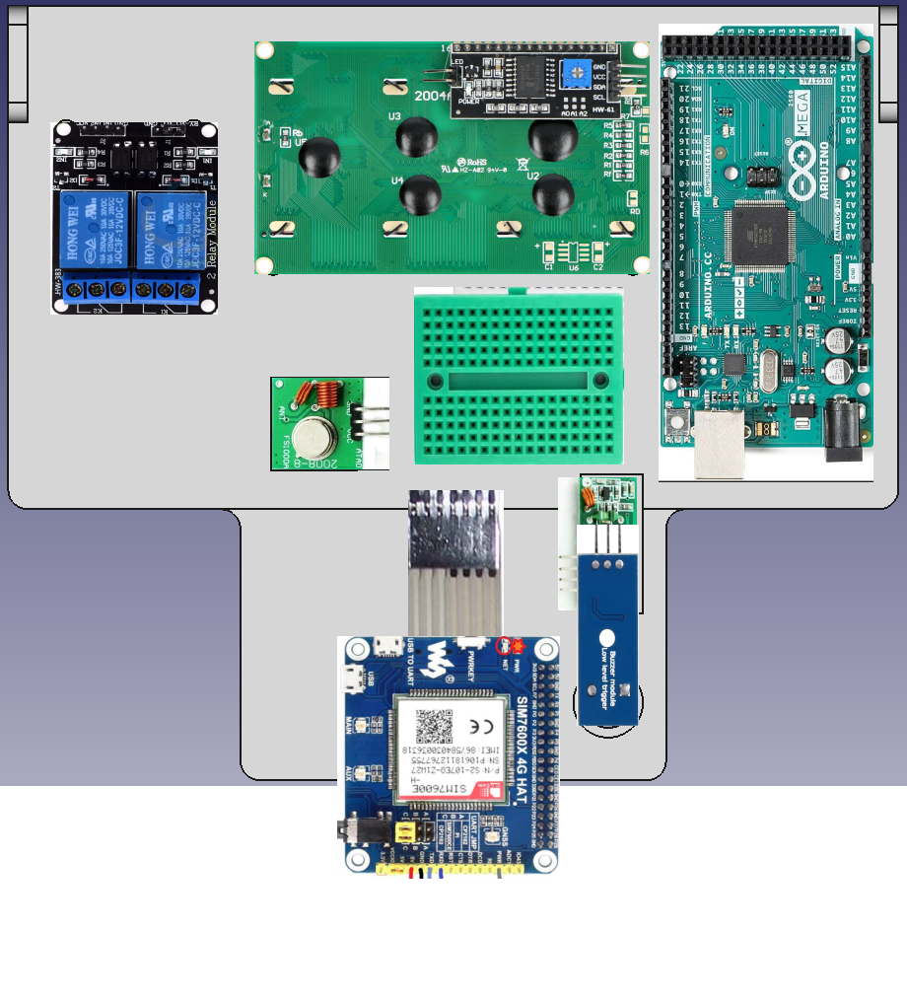

## File e moduli

Il progetto è organizzato in più file `.ino`, ognuno responsabile di una funzionalità specifica:

- **[AllarmeGSM.ino](AllarmeGSM.ino)**: setup/loop, variabili globali, stato, inizializzazione LCD, RF, tastiera e EEPROM. File principale del progetto.
- **[gsm.ino](gsm.ino)**: gestione SIM7600 (`PowerOn()`, `sendATcommand()`, `SendingShortMessage()`), attivazione/disattivazione alimentazione modulo via pin POWERKEY.
- **[eeprom.ino](eeprom.ino)**: lettura/scrittura seriale, PIN, telefono, sensori RF in EEPROM; controllo versione `VERSION = 119`.
- **[keyboard.ino](keyboard.ino)**: scansione tastiera 4x3, gestione PIN e transizioni di stato (NORMAL ↔ CONFIG).
- **[lcd.ino](lcd.ino)**: gestione display LCD 20x4 con schermate `LCDNormal()` (stato) e `LCDConfig()` (menu).
- **[menu.ino](menu.ino)**: menu di configurazione e azioni (`ConfigOptions()`, `CheckKeypadMenu()`, `GetConfig()`).
- **[config.ino](config.ino)**: funzioni pratiche per RF e test (`TestIO()`, `SendRFCode()`, `GetRFCode()`, `DelRFCode()`).
- **[utility.ino](utility.ino)**: buzzer, logica allarme (`AlarmON()`, `AlarmOFF()`), SMS di attivazione/disattivazione, abilitazione RF.
- **[sketch.json](sketch.json)**: configurazione target board Mega 2560.
- **[launch.json](launch.json)**: placeholder VS Code.

## Librerie utilizzate
- `LiquidCrystal_I2C`
- `RCSwitch`
- `EEPROM`
- `SPI`

Installabili tramite Library Manager dell’Arduino IDE. Il modulo GSM usa comandi AT su `Serial1`.

## Configurazione iniziale
- Valori di default: `SERIALE = L000001`, `PIN = 1234`, `PHONENUMBER = 3450726127`.
- Modifica tramite menu: "Modifica Seriale", "Modifica PIN", "Modifica Telefono".
- Sensori RF: "Associa Sensori" per registrare e "Elimina Sensori" per cancellare. Fino a 20 sensori (`RFValues[20]`).

## Compilazione e Upload
### Arduino IDE
- Apri la cartella del progetto e seleziona la scheda "Arduino Mega or Mega 2560".
- Installa le librerie richieste (LiquidCrystal_I2C, RCSwitch, EEPROM, SPI).
- Compila e carica lo sketch.

### Arduino CLI (esempio)
Assicurati di avere `arduino-cli` installato.

```bash
arduino-cli core update-index
arduino-cli core install arduino:avr
arduino-cli compile --fqbn arduino:avr:mega .
arduino-cli upload -p /dev/ttyACM0 --fqbn arduino:avr:mega .
```
Sostituisci la porta seriale (`/dev/ttyACM0`) con quella del tuo Mega.

## Note su GSM (SIM7600)
- Connessione al Mega su `Serial1` (TX1/RX1) per comandi AT.
- Alimentazione controllata via `GSMRELAY` e pin `POWERKEY`.
- Routine di attesa segnale e invio SMS integrate (vedi [gsm.ino](gsm.ino)).

## Troubleshooting
- Nessun segnale GSM: verifica antenna, alimentazione e copertura; controlla `PowerOn()`.
- LCD vuoto: verifica indirizzo I2C (0x27) e connessioni SDA/SCL.
- Sensori RF non rilevati: controlla alimentazione modulo RF e associazione corretta.
- Sirena non attiva: verifica `EXTRELAY` e cablaggio del relè.

## Roadmap / Idee
- Integrazione HTTP/IoT (sono presenti variabili `serverName/ServerHost/ServerPath` non ancora utilizzate nel flusso principale).
- Stato avanzato e log eventi.

---
Progetto analizzato automaticamente dai sorgenti; se vuoi, posso aggiungere immagini di cablaggio o esempi di schermate LCD.